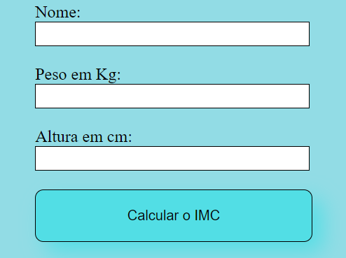

    

## 📊 Projeto
Esse é um projeto de uma calculadora para exibir o Índice de massa corporal (IMC).

## 👨🏽‍💻 Tecnologias
Esse projeto foi desenvolvido durante uma aula de Programação em Scripts com as seguintes tecnologias:

- HTML
- CSS
- JavaScript
- Git e Github

## Link do projeto
Você pode visualizar o projeto através [desse link](https://matheuscesaramaral.github.io/IMC)
